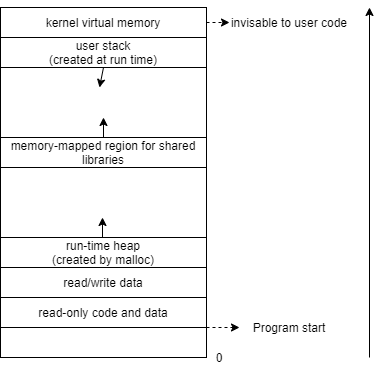

# 操作系统

## 进程Process

A process is an instance of a computer program that is currently being executed.

### 进程虚拟内存布局

  

### 进程的状态？

* 开始一个进程：```fork```
* 就绪Runable：已经获得CPU外的全部资源
* 执行Running：被调度到CPU执行(in user/kernel space)
* 睡眠Sleep：等待某种条件以执行
  * 浅睡眠Interruptible Sleep：等待被信号唤醒
  * 深睡眠Uninterruptible Sleep：不能被信号唤醒，只能在资源就绪或者超时后结束
* 终止Terminate/Stop：```exit```或者收到终止信号
  * 该进程释放内存，不释放PCB，向其父进程发送信号```sigchld```
  * PCB由其父进程负责释放(由此可能导致进程的僵尸Zombie状态)

### 进程与线程的区别？

Linux线程由```pthread_create```产生，也像进程一样clone父进程，区别是mm、fs、signal、sighand、pending数据是否与父进程共享

进程是操作系统资源分配的最小单位，是一个**拥有资源**和**执行任务**的单元体。  
线程是CPU任务调度和执行的最小单位，是一个**执行任务**的单元体。  
||进程|线程|
|:---:|:---:|:---:|
|资源|**独有**内存空间的代码、数据，I/O 资源，文件，处理机等|**独有**处理机，**共有**内存、文件、I/O 等|
|切换开销|大，需要切换处理机的上下文，还需要切换内存等资源（页表、文件、进程控制的通信队列、阻塞队列等）|小，只需要切换处理机上下文（寄存器、栈、错误返回码、信号屏蔽码等）|
|包含性|包含多个线程|进程的一部分，轻量级进程|
|健壮性|健壮，多进程之间不会互相干扰|一个线程出错会终止整个进程|
|安全性|资源独立，安全性好|资源共享，安全性差|
|通信|很多方式|一般用共享内存，效率高，但操作系统不负责同步|

### 为什么要区分用户态和内核态？

考虑权限问题，一些不当的行为可能会对操作系统产生危害，这些行为主要涉及到与硬件的直接交互，如：直接操纵cpu访问存储器的任意位置、不合时宜地请求 I/O，申请过多地系统资源等。为了限制用户进行这些危险的操作，引入两种模式，用户程序在用户态工作，当需要执行一些特权操作时，通过系统调用函数切换至内核态来执行，内核态中操作系统会对这些操作请求进行协调。  
反过来说，操作系统进行的一些与用户程序业务无关的行为，也不应该和用户态下的行为相耦合，比如说进程之间的切换、I/O 操作等，就需要让程序首先陷入内核态，再进行切换的工作。
  
### 什么时候会陷入内核态？

* 系统调用：用户进程主动发起系统调用函数。
* 中断：I/O 就绪了、外部设备有信号了、定时器到时间了等等，操作系统需要使用 cpu 或其他硬件资源去响应中断，这时会陷入内核态使用中断处理函数来处理。
* 异常：程序出现了异常，如除零、缓冲区溢出、缺页等等，会陷入内核态调用响应处理函数来处理。

### 空指针会不会陷入内核态？

会，空指针相当于访问虚拟地址，这个地址没有映射物理地址时就会抛出异常。异常会陷入内核态。

### 内核态用户态切换过程？

用户态-->内核态：保存用户态的栈指针，设置寄存器指针指向内核态的栈底（内核态每次进入重新有效）  
内核态-->用户态：恢复用户态的栈指针，无效内核态栈内信息  

### 进程间的通信方式有哪些？

* 信号
  * 操作系统或用户预先定义信号处理程序
  * **操作系统**可以向某个进程发送这些信号，**进程**也可以通过系统调用来向其他进程发送信号（kill），**硬件**也可以发送信号（CTRL + C）
  * 进程维护一个**信号队列**，用来指示哪些信号是被激活的；进程还可以维护**阻塞队列**，来拒绝接收某个信号，拒绝接收的信号会由内核保存，直至该进程取消阻塞再发送该信号
  * 当该进程从内核态切换到用户态时（系统调用、上下文切换等），检查信号队列的标志位，查看是否收到信号，并执行对应的信号处理程序
* 管道
  * **单向半双工**，传输**字节流**，只能用于**亲缘进程**（兄弟、父子）之间，常用于 Linux 多个命令之间的**大量**数据的通信

    ```shell
    # ps进程输出全格式所有进程信息并输入grep进程
    # 操作符 '|' 调用了系统函数pipe()
    ps -ef | grep java
    ```

  * 上游进程的 STDOUT 写入管道文件，下游进程的 STDIN 读取管道文件，类似生产者消费者模型
  * 管道文件为内存中的一块**循环缓冲区**，可重复使用，进程对管道读写的**同步**以及管道**生命周期**由操作系统管理
* 命名管道
  * **没有亲缘关系限制**的管道，通过系统调用 ```mknode()``` 来建立，并在磁盘中生成管道索引文件，但是这个文件没有数据区，只记录了有访问权限的进程，数据区同样是内核中的循环缓冲区
  * 磁盘的索引文件不受操作系统管理（不会删除），但内核缓冲区生命周期受操作系统管理
  * 其他同管道
* 信号量
  * 通过对一个量 S 的原子操作，实现进程间的同步（存在一个信号量阻塞队列）
  * P 操作：
  ```S -= 1; if S < 0 wait else go```
  * V 操作：
  ```S += 1; if s < 0 notify else go```
* 共享内存
  * 进程们通过 ```mmap()``` 等方法获取对同一块内存的访问权限
  * 需要进程**自己完成同步操作**，如结合信号量
* 消息队列
  * **内核**维护的**有格式**的**链表结构**，每个节点有**唯一 key**，用来标识消息
  * 优点：比起信号，传递信息要多；比起管道，能传递有格式数据；能根据 key 选择性接收信息
  * 缺点：消息发送与接收是**异步**的，需要轮询才能确定是否有消息发送或消息是否已被接收
* 套接字
  * 通过（协议，发送方ip，发送方端口号，接收方ip，接收方端口号）的五元组来唯一标识socket，通过socket唯一标识一个链接
  * 可用于本地或网络间的进程通信

---
  
## CPU任务调度

### 有哪些任务调度策略的评价指标？

* **CPU利用率**：CPU 忙碌时间/总时间，I/O 等待过多会降低该指标
* **吞吐量**：单位时间完成任务数量
* 周转时间：每个作业从提交到完成的平均时间
* 等待时间：任务就绪等待调度的时间，不包括 I/O 等待，因为这是外设为任务服务的时间
* 响应时间：提交请求到第一次响应的时间
  
### 有哪些任务调度算法？

* 按 CPU 的分配方式来分
  * 抢占式：本任务结束前可被其他任务抢占执行
  * 非抢占式：本任务结束前一直进行本任务
* 按分时方式来分
  * 批处理系统调度：无需 I/O 交互
    * **目标**：高吞吐量、低周转时间、高CPU利用率
    * 先来先服务 First Come First Service
      * 非抢占式
      * 优点：实现仅需要一个就绪队列
      * 缺点：对短作业不公平，不宜处理 I/O 密集型作业
    * 最短作业优先 Shortest Job First
      * 需要预知作业执行时间，非抢占式
      * 优点：平均周转时间短
      * 缺点：对长作业不公平，可能出现饥饿现象
    * 最短剩余时间优先 Shortest Remaining Time Next
      * 最短作业优先的抢占式版本
    * 最高响应比优先 Highest Response Ratio Next
      * 响应比：周转时间/估计执行时间
      * 优点：综合考虑等待时间和执行时间，尽可能让执行时间短的任务和等待时间长的任务优先执行
  * 交互分时系统调度：
    * **目标**：除了批处理系统调度目标外，还追求低响应时间
    * 时间片轮转 Round Robin
      * 队列实现，每个任务运行固定时间片时间，然后置于队尾，抢占式
      * 优点：彻底避免饥饿问题
      * 缺点：时间片过短，则需要进行频繁进程切换，吞吐量低；时间片过长，则响应时间会过长
    * 优先级调度算法 Priority
      * 高优先级任务优先调度，同优先级任务时间片轮转
      * 缺点：低优先级任务会饥饿
    * 多级反馈队列 Multilevel Feedback Queue
      * 高优先级任务优先调度，且优先级越高，时间片越短；一个时间片未完成的任务，置于下一优先级队列尾
    * 彩票法、公平分享法等
  * 实时系统的调度算法
    * **目标**：期望作业的尽快完成，或在规定截止时间内完成，而不会有较长的延时
    * 最早截止时间优先算法。
  
---

## 内存管理

### 有哪些内存分配方法？

* 连续分配方式
  * 等长固定分区法
    * 系统启动时将物理内存分为固定大小固定数量的区，每个区放一个进程
    * 优点：操作系统内存管理简单，只需维护固定分区的使用情况即可；无外部碎片
    * 缺点：分区大小固定，限制了进程的最大大小，且对于小进程来说会产生大量内部碎片；分区数量固定，限制了并发数
  * 不等长固定分区法
    * 系统启动时分配不固定大小，固定数量的区，每个区放一个进程
    * 优点：可以减少内部碎片
    * 缺点：数量固定，限制并发
  * 动态分区法
    * 使用空闲链表进行组织
    * 优点：并发数量不受限制，只取决于是否有可用内存块
    * 缺点：会有很多外部碎片
* **离散分配方式**
  * 页式内存管理
    * 将固定分区大小缩小为多个**固定大小**的页，每个进程可使用多个不连续页，逻辑上**操作系统**使用页表将整个进程相连
    * 优点：比起连续内存分配方式，提高了内存利用率：一个进程可以完全占有多个页，只有最后一页会有内部碎片；页之间不会有外部碎片
    * 缺点：不利于数据共享
  * 段式内存管理
    * 按逻辑意义将程序分为多个**不定大小**的段，每个段独立载入到连续内存上，逻辑上需要**程序自己**用[段长：基址]二元组定位物理位置。
    * 优点：比起分页，更容易实现数据共享与保护，如代码段共享库
    * 缺点：一个进程的某个段不能分割，需要连续分配在物理内存中；容易产生**外部碎片**
  * 段页式内存管理
    * 先把程序按逻辑意义分为多个段，每个段再分为固定大小的页，每个页映射到物理内存页上

### 有哪些动态内存分配方法？

* 最佳适配法
  * 遍历空闲分区，选择大于申请内存大小的最小内存块
  * 优点：能够留下大空闲分区
  * 缺点
    * 遍历操作耗时
    * 会留下很多外部碎片
* 最差适配法
  * 遍历空闲分区，选择最大内存块来分配
  * 优点
    * 会留下很多小内存块
    * 不会有很多外部碎片
    * 内存块大小会趋于均匀，适合请求分配内存大小范围小且统一的系统
  * 缺点
    * 遍历操作耗时
    * 不会有大空闲分区供大进程使用
* 首次适配法
  * 从头遍历空闲分区，直到找到能够使用的分区
  * 优点：高地址处可留下大空闲分区
  * 缺点：低地址地区会产生很多外部碎片，这又不利于下一次的遍历
* 下次适配法
  * 从上一次遍历的节点开始查找第一个能够使用的分区
  * 优点：速度快
  * 缺点：很难有大空闲分区供大进程使用

### 虚拟内存是什么？

* 虚拟内存可看作是一种缓存的工具
  * 每个进程分配独立连续的虚拟内存，整个虚拟内存又被划分为一系列**虚拟页**，虚拟页大小和划分物理内存的**页帧**大小相同
  * CPU 访问地址时，程序上使用虚拟内存的页地址，即**虚拟地址**，通过 MMU （Memory Management Unit）转译为真实存在的物理内存的页地址，即**物理地址**
  * MMU 有两种方法翻译虚拟地址
    * 通过存储在物理内存中的**页表**结构，该结构描述了从虚拟地址到物理地址的对应关系，和每个地址的一些标志位。值得一提的是，页表仅仅将虚拟地址的前几位映射到物理地址的前几位，而后几位虚拟地址则作为**块偏移**直接等值映射到物理地址的后几位
    * 通过存储在 MMU 中的 TLB （Translation Lookaside Buffer），该结构可看作是页表的缓存
  * 页表中有标志位能够描述虚拟内存地址**是否命中**，即虚拟地址对应的磁盘中的文件（也可能对应物理内存中的缓冲区等）是否已经加载入物理内存，若命中，则直接去内存中取，否则触发**缺页异常**，将数据加载入物理内存
  * 以上描述忽略了 CPU 与物理内存之间的高速缓存
* 虚拟内存还可看作是内存管理的工具
  * 虚拟内存**简化了链接过程**。链接后的可执行文件不必知道代码段、数据段在物理内存中的具体位置，因为虚拟内存提供了**统一的地址空间**，如 64 位进程代码段总是从虚拟地址 ```0x400000``` 开始的
  * 虚拟内存**简化了加载过程**。不会一口气将全部代码、数据加载入物理内存，而是仅仅进行**内存映射**，将虚拟内存映射到磁盘中代码数据文件，待使用时通过缺页异常来加载
  * 虚拟内存**简化了共享**。不同进程可将虚拟页映射至相同物理页，如库函数代码共享
  * 虚拟内存**简化了内存分配**。在动态内存分配时可以直接分配连续虚拟页，而实际在物理内存中可以离散存在
* 虚拟内存还可看作内存保护的工具
  * 页表中的标志位还可用来描述**权限**，例如只读、只写、是否超级用户等。通过标志位的设置，可控制某进程对某内存页的访问权限。

### 被交换出内存的数据存在哪里？

存储在交换分区（swap）中，物理内存不足时会将页面置换入交换分区。物理内存和交换分区的总大小即可用虚拟内存的总量。
  
### 有哪些内存页置换算法？

1. 最佳置换算法（OPT）：选择未来不会用到的页面或最久不会使用的页面淘汰。非因果，基本不可能实现。
2. 先进先出算法（FIFO）：将最早装入的页面换出
   * 优点：队列实现，简单高效，适合于要求数据时效性的场景（如 Redis 缓存）
   * 缺点：可能会淘汰掉很常用的页
3. 第二次机会置换算法（SCR）：FIFO 算法的改进，队列中每个节点维护一个标志位，代表是否有第二次机会。置换时检查队列尾的页面是否有第二次机会，若有则将标志位置零，并作为新页面插入队首，否则丢弃；命中时将标志位置 1，表示该页被经常使用。
   * 优点：一定程度上避免了淘汰掉常用页
4. 时钟置换算法（Clock）：SCR 的改进，实现由队列变为环形链表，简化了将队尾元素插入队首的操作，降低了开销。
5. **最近最少使用算法（LRU）**：淘汰掉最久未被使用过的页面。
   * 优点：利用局部性原理，能够保证热点数据缓存命中率，适用于热点数据变化不大的情况
   * 缺点：若出现**缓存污染**，即偶发性的冷数据批量访问，则会出现大量不命中
6. LRU-K 算法：淘汰掉最久使用次数未达到 K 次的页面，或达到 K 次的最久未被使用的页面。能够在一定程度上减轻缓存污染的影响
7. 最近最不经常使用算法（LFU）：淘汰掉最近访问次数最少的数据。
   * 优点：可以避免偶发性的缓存污染
8. 随机淘汰算法（Random）
  
### 栈和堆的区别？

||栈|堆|
|:---:|:---:|:---:|
|增长方向|虚拟内存中向低地址增长|向高地址增长|
|分配回收|自动分配回收，空间连续|手动申请释放，空间不连续|
|生命周期|函数运行过程中|申请后到释放前|
|空间大小|有限|较大，受限于有效虚拟内存|
---

## I/O 模型

### 有哪些 I/O 模型？

阻塞 I/O、非阻塞 I/O、I/O 多路复用、信号驱动式 I/O、异步 I/O

### 如何实现 I/O 多路复用？

* 单个线程使用非阻塞 I/O 轮询每个文件描述符，查看其是否就绪
  * 缺陷：每次轮询都会发起一个系统调用查看一个文件描述符的就绪情况，会造成内核态和用户态的反复切换
* 单个线程使用一次 **I/O 多路复用系统调用**，并阻塞，轮询操作放在内核中执行。如 ```select```、```epoll```

### select、poll、epoll 的区别？

||select|poll|epoll|
|:---:|:---:|:---:|:---:|
|监听描述符列表|bitmap实现|链表实现|红黑树实现|
|就绪描述符列表|在bitmap上直接修改|在链表上直接修改|开辟新队列存储|
|监听描述符数量|有上限，一般为1024|无限制|无限制|
|就绪描述符检查|需要遍历所有描述符，慢|需要遍历所有描述符，慢|直接在就绪队列里检查，快|

---

## 部分来源

<https://imageslr.com/2020/07/08/tech-interview.html>
