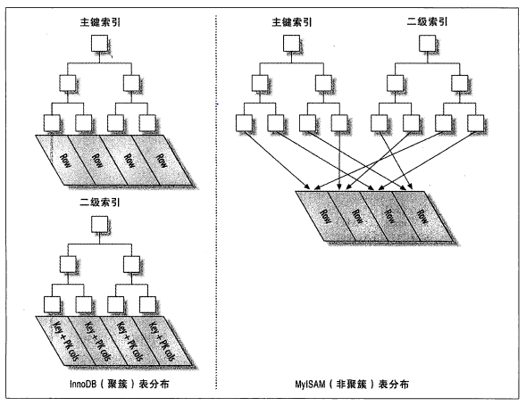

# 数据库

## MySQL

---

### MySQL架构与基础

#### MySQL分层设计

1. 连接处理、授权认证、安全  
   管理与客户端之间的连接
2. 查询的解析、分析、优化、缓存以及跨存储引擎的功能(存储过程、触发器、视图)  
   MySQL解析查询, 创建内部解析树, 进行查询优化(重写查询、确定表读取顺序、选择索引).通过`explain`一个SQL语句了解优化方案.
3. 存储引擎  
   插件方式

存储引擎

1. InnoDB：最广泛使用的存储引擎, 支持事务, 行级锁, 外键完整性约束, 崩溃恢复, MVCC.
2. MyISAM：快速的存储引擎, 不支持事务, 只支持表级锁.
3. Memory：在内存中创建数据, 速度最快, 不支持事务, 只支持表级锁.适合快速查询或临时表场景.
4. CSV：将数据存储为 CSV 格式, 可被其他应用读取.
5. Merge（MRG_MyISAM）：MyISAM 表的组合, 更容易处理大批量数据, 一般用于数据仓库的管理（如日志处理）.
6. Archive：会对插入数据进行压缩, 只支持插入和查询, 适合归档用.
7. Blackhole：接收请求并进行处理, 但不存数据, 查询永远返回空集, 可用于性能测试.
8. Federated：将多个物理数据库集合为一个逻辑数据库, 本地服务器上的查询将在远程数据库中自动执行.适用于分布式场景.
9. Example：只能创建表, 不能存取数据, 可以用来学习编写新的存储引擎.

InnoDB,  MyISAM,  Memory对比

||InnoDB|MyISAM|Memory|
|:---:|:---:|:---:|:---:|
|存储文件|表结构文件 ```.frm```  数据和索引文件 ```.idb```|表结构文件 ```.frm```  数据文件 ```.MYD```  索引文件 ```.MYI```|表结构文件 ```.frm```|
|索引存储结构|B+ 树, 聚簇索引|B+ 树, 非聚簇索引（二级索引, 辅助索引）|hash|
|数据存储位置|主键树的叶子节点存放完整的行数据  普通索引树的叶子节点存放索引值和主键值|与索引分离, 索引的数据区存放行指针（偏移）|内存中|
|存储物理结构|文件表分为段（segment）, 段分为区（extent）, 区分为页（page）  每页存放一个 B+ 树节点, 相邻节点的页物理上不必连续|行在文件中连续存储, 用偏移量来定位|-|
|事务|支持|不支持|不支持|
|锁机制|支持行锁, 并发更新处理优秀|只支持表锁|只支持表级锁
|外键|支持|不支持|不支持|不支持|
|全文索引|需要使用插件|支持|不支持|
|读|需要维护 MVCC, 可能有回表, 寻址要从区到页再到行, 慢|无回表, 寻址快|快|
|写|需要维护日志, MVCC, 慢|快, 但受表锁影响大|快|
|空间占用|有日志, 大|索引能压缩, 小|-|
|数据恢复能力|可通过日志安全恢复|只能人工备份恢复|无|

#### 事务

1. ACID(原子性、一致性、隔离性、持久性)
2. 隔离等级(事务内与事务间的可见性)  
   * Read Uncommitted(未提交读)：事务中的修改, 即使没有提交, 对其他事务也是可见的.其他事务可以读取当前事务尚未提交的数据(出现脏读).
   * Read Committed(提交读)：一个事务开始到提交前, 所做的修改对其他事务不可见.(出现不可重复读)
   * Repeatable Read(可重复读)：同一个事务多次读取同样的记录结果一致.(出现幻读)
   * Serializable(串行)：事务串行执行.

ACID

* 原子性：整个事务中的所有操作, 要么全部完成, 要么全部不完成.事务执行过程中出错, 则回滚到事务开始前的状态.
* 一致性：一个事务可以封装状态的改变.即事务必须始终保证系统处于一致的状态, 数据完具有完整性.例如, 5个银行账户, 无论并发多少个转账事务, 这5个账户内的金额总数必须不变.
* 隔离性：隔离状态执行事务, 使它们好像是系统在给定时间内而唯一执行的事务, 同一时间只能有一个事务访问同一个数据.又称为串行化.
* 持久性：事务完成后, 更改会持久地保存在数据库中, 不会被回滚, 即提交的事务一定能被保存.

数据库如何实现事务的四个特性

1. 通过**undo log**实现原子性
   * undo log 记录逻辑语句, 回滚时执行对应语句的逆向操作.
2. 通过**redo log**实现持久性(WAL)
   * 数据在内存中更改后, 首先写入实际数据到 redo log 并将 redo log 写入磁盘中, 然后再提交事务, 并在 redo log 中标记该事务为提交.实际数据持久化进度由 redo log 的 checkpoint 控制, checkpoint 位置不超过最后一次提交的事务.
   * redo log 进行数据持久化入库的过程是**原子的**, 因为其单位块为 512 字节, 和磁盘扇区一致.整个块能原子地持久化入磁盘中.
3. 通过**锁**和**MVCC**实现隔离性(MVCC是依靠undo log实现的)
   * 通过行锁与间隙锁实现当前读
   * 通过MVCC实现快照读(不需要获取任何锁)
4. 通过**键**约束保证一致性.

二次提交流程

1. prepare：在内存中更改数据, 将更改的数据具体内容存入 redo log, 并完成 redo log 文件的持久化, redo log 文件中记录这个事务状态为 **prepare**.
2. commit：将 sql 逻辑写入 bin log, 并完成 bin log 文件的持久化, 接着将 redo log 对应的事务状态设置为 **commit**, 再刷一次盘.此时 bin log 和 redo log 的进度是**一致的**, 但数据库中的持久化进度可能还很落后, 具体进度用 redo log 文件中的 checkpoint 指针来表示.
3. 若在二次提交过程中崩溃了, 就可以利用 redo log 的两个状态, 保证 redo log 的进度向 bin log 看齐.具体来说：
   * 从 checkpoint 处开始遍历 redo log, 若事务已被标记为 commit, 则说明 bin log 中已经有了这条记录, 其他所有数据库也都认同这个 bin log 进度, 大家是一致的
   * 若事务未被标记为 commit, 但 bin log 中已经有了对应事务的记录, 则说明其他数据库认为应该有这条记录, 但崩溃的数据库的 redo log 没提交事务.虽然 redo log 存有这个事务的物理数据, 但由于没提交, 不能把这条记录持久化入数据库.此时需要在 redo log 中把事务重新设置为 commit
   * 若事务未被标记为 commit, 且 bin log 也没有对应事务的记录, 说明其他数据库群不认同这条记录, 那么崩溃服务器的 redo log 只需要将还处于 prepare 状态的事务的数据删除即可

redo log的二次提交解决什么问题

* 解决单个数据库 redo log 和 bin log 的**一致性**问题, 进一步保证分布式数据库的一致性, 因为分布式数据库的一致性是通过同步 bin log 来保证的.

  * 所有数据库中持久的数据应该以 bin log 为准, bin log 未记录的, 数据库中不应该存在相应数据；bin log 有记录的, 数据库必须在未来要完成这条记录的持久化
  * bin log 无法实现崩溃恢复, 因为它只做记录, 不进行实际数据刷盘持久化过程, 因此不知道实际持久化的进度达到自己记录的哪个位置了
  * redo log 就是用来持久化的, 它存有修改的**物理数据**, 它用来将数据刷盘至数据库, 掌握着数据库持久化的实际进度.但由于它的空间大小限制(循环空间), 无法掌握整个数据库群的进度.
  * redo log 的二次提交, 就保证了 bin log 的逻辑数据一定在 redo log 里有物理数据, 同时告诉了 redo log 应该按照 bin log 的记录进行 commit, bin log 记录到哪, 它就 commit 到哪

事务的死锁

* InnoDB检查死锁, 回滚拥有最少行锁的事务.

事务日志(Write AHead Logging)--redo log

1. 先用append的方法写事务日志(顺序IO)
2. 数据异步写磁盘

#### 并发控制

1. 读写锁(共享锁与排他锁)
2. 锁粒度(表级锁与行级锁)

多版本并发控制(MVCC)

* 每一行加2个隐藏的列, 行的创建时间与行的删除时间(实际上是系统版本号)
* INSERT: 插入的每一行创建时间为当前系统版本号
* DELETE: 删除的每一行删除时间为当前系统版本号
* UPDATE: 插入一行新记录, 创建时间为当前系统版本号；修改原来一行旧记录, 删除时间为当前系统版本号
* SELECT: 只查询版本号满足条件的, 创建时间**小于等于**当前系统版本号(当前事务开始时该行已经存在或者是本事务插入或者修改的), 同时要求删除时间没有设置或者**大于**当前系统版本号(当前事务开始时该行没有删除).
  
---

### 数据库基准测试

指标

* 吞吐量：单位时间内事务的处理数.(TPS)
* 响应时间：百分比响应时间.(95%响应时间)
* 并发性：测试中一种属性
* 可拓展性：

测试的坑

* 使用真实数据的子集而不是全集
* 使用错误的数据分布(忽略了热点数据)
* 与真实用户行为不匹配
* 忽略了系统预热
* 测试时间太短
* 等等

分析SQL查询

1. 分析服务器负载(慢日志查询)：慢日志查询工具
2. 分析单条查询：`Show Profile` 与 `Performance Schema`
3. 间歇性问题:
   * 单条查询问题还是服务器问题？
      * `show global status`确定每秒查询数、Threads_connected和Threads_running
      * `show processlist`观察线程状态

### Schema与数据类型优化

数据类型：满足条件下更小 简单 避免null

* 整数类型`tinyint ~ bigint`
* 实数类型`float double decimal`
* 字符串类型`varchar char`(varchar(64)与varchar(8)硬盘存储相同 64内存消耗更多)
* BLOB与TEXT(很大的数据 不能进行索引)
* 枚举类型ENUM(一些情景下替代字符串类型 减小存储大小)
* 日期和时间类型`datetime timestamp`
* 位数据解列`bit set`
* 标识列(选择合适的数据结构)
  * 整数类型：一般ok
  * 字符串类型：避免 消耗空间而且导致插入查询变慢
* 特殊数据类型(IPv4地址 32位无符号整数)

Schema设计陷阱

* 太多的列(服务器层与存储引擎层之间通过行缓冲拷贝数据 在服务器层将缓冲转换为列 转换的代价依赖于列的数量)
* 太多的关联
* 过度使用枚举

范式与反范式

* 范式(写密集场景)
  * 优点: 没有多余的数据,  更新更快,  检索时需要更少的group by与distinct
  * 不足: 通常需要关联,  可能导致索引策略失效
* 反范式
  * 优点: 避免关联,  可以使用更有效的索引策略

汇总表与缓存表

* 汇总表: 实时计算统计值代价很大,  用一张表保存**聚合后**的数据(例子: 统计24小时内消息发送数,  可以每小时生成一张汇总表,  查询时直接查找汇总表)
* 缓存表: 缓存原始表中部分数据

Alter table操作注意

* 常用方式: 主备切换,  影子表拷贝
* alter table 不重建表(修改默认值,  移除一个列auto_increment属性,  增删查改enum或者set),  写好sql

### 索引

* 索引类型

  1. [B+ Tree](./ref/B+Trees.pdf "B+ Trees")索引

     * B树: 多路树, 每一个节点都包含多个键(索引)和指针, 每一个节点都是data page
     * **B+树**: 多路树, 节点包括data page与index page, 叶子节点都是data page
     * 适用全键值,  键值范围,  键前缀查找(最左前缀)
     * 全值匹配: 和索引中所有列进行匹配
         * 匹配最左前缀: 只是用索引的第一列
         * 匹配列前缀: 只匹配某一列的值的开头部分
         * 匹配范围值
         * 精确匹配某一列并范围匹配另外一列
         * 只访问索引的查询
     * 限制
       * 不是索引的最左列开始查找则无法使用索引
       * 不能跳过索引中的列
       * 查询中有某个列的范围查询则右边所有列无法使用索引

  2. 哈希索引

     * 只能在精确匹配所有列时使用
     * 可以在B+Tree上使用伪哈希索引加速查询

        ```SQL
        create table pseudohash
        (
           id      int auto_increment
              primary key, 
           url     varchar(255)             not null, 
           url_crc int unsigned default '0' not null
        )
        -- 触发器
        delimiter //

        create trigger pseudohash_crc_ins before insert on pseudohash for each row begin set NEW.url_crc=crc32(NEW.url);
        END;

        create trigger pseudohash_crc_upd before update on pseudohash for each row begin set NEW.url_crc=crc32(NEW.url);
        END;

        delimiter ;
        ```

  3. 空间索引(地理位置)

  4. 全文索引(文本)

* 索引好处

   1. 减少服务器扫描数据量
   2. 避免临时表和排序
   3. 随机IO变为顺序IO

* 索引策略

   1. 独立的列(索引列不能成为表达式的一部分)
   2. 前缀索引和索引选择性
      * 前缀索引: 索引开始的部分字符
      * 选择性: 不重复索引值/数据表记录总数
   3. 多列索引(完全没有必要)
   4. 选择合适索引列顺序
   5. 聚簇索引: 一种数据存储方式
      * 好处:
        * 相关数据保存在一起,  减少IO
        * 数据访问快
      * 缺点:
        * 插入速度依赖插入顺序
        * 更新聚簇索引列代价高
        * 页分裂导致更多硬盘占用
        * 二级索引需要两次索引查询,  二级索引叶子节点上是主键
      * 主键策略
        * UUID: 分散,  页分裂
        * 自增主键: 顺序插入(高并发时auto_increment导致锁竞争严重)

      
   6. 覆盖索引: 索引包含所有需要查询的字段
   7. 使用索引扫描进行排序
      * 只有索引的列顺序和order by子句的顺序完全一致,  而且所有列的排序方向都一样时,  才可以使用索引来进行排序
      * 如果需要关联多张表,  order by子句的字段需要全部为第一个表
      * order by也需要满足最左前缀匹配

      ```SQL

      create table rental (
         ...
         primary key (rental_id), 
         unique key rental_date (rental_date,  inventory_id,  customer_id), 
         key idx_fk_inventory_id(inventory_id), 
         key idx_fk_customer_id(customer_id), 
         key idx_fk_staff_id(staff_id), 
         ...
      )

      -- 使用两种排序方向 但是索引列都是正序的
      ... where rental_date ='2021-08-26' order by inventory_id desc,  customer_id asc;
      -- order by中使用不在索引中的列
      ... where rental_date = '2021-08-26' order by inventory_id,  staff_id
      -- 无法构成组合索引的最左前缀匹配
      ... where rental_date = '2021-08-26' order by customer_id;
      -- 索引列的第一列上时范围查询 无法使用索引的其他列
      ... where rental_date > '2021-08-26' order by inventory_id,  customer_id;
      ```

   8. 冗余的索引
   9. 索引与锁: 索引减少锁定的行

* 索引案例
  1. 支持多种过滤条件: 范围查询的列放在索引的后面
  2. 避免多个范围条件: 范围条件转换为等值查询
  3. 优化排序与翻页: 延迟关联

### 查询性能优化

* 访问类型
  1. all: 全表扫描
  2. index: 按照索引顺序全表扫描(可能回表,  或者索引覆盖)
  3. range: 有范围的索引扫描
  4. ref: 使用了不唯一的索引
  5. ref_eq: 使用了唯一的索引(unique或者primary)
  6. const: 主键为where查询条件

* 查询线程的状态(MySQL连接)
  1. sleep: 等待客户端发送请求
  2. query: 正在执行查询或者返回结果
  3. locked: MySQL服务器层,  正在等待表锁
  4. analyzing and statistics: 搜集存储引擎信息
  5. copying to tmp table: 执行查询,  结果集复制到临时表中
  6. sorting: 结果集排序
  7. sending data: 多个状态间传输数据,  或者生成结果集,  或者返回数据

* 查询慢原因
  1. 查询看作一个任务,  则由一系列子任务构成 优化查询则要消除部分子任务或者减少子任务执行次数或者子任务运行更快
  2. 优化数据访问
      * 是否向数据库请求了不需要的数据
      * MySQL是否在扫描额外的记录
        * 响应时间(服务时间与排队时间)
        * 扫描的行数与返回的行数
        * 扫描的行数与**访问类型**
* 重构查询的方式
  1. 一个复杂查询还是多个简单查询
  2. 切分查询(分散压力)
  3. 分解关联查询
     * 缓存命中率提高
     * 执行单个表的查询减少锁竞争
     * 应用层关联更容易做数据库拆分
* 查询执行处理
  * 过程
    1. 客户端发送SQL给服务器
    2. 服务器先查询缓存,  命中缓存则直接返回缓存结果
    3. 服务器机械SQL解析,  预处理,  由优化器生成对应的执行计划
    4. 调用存储引擎API执行查询
    5. 结果返回客户端
  * 语法解析与预处理
  * 查询的优化器: 根据存储引擎提供的优化信息,  预测不同查询计划的成本进行优化
  * 数据与索引的统计信息: 来自存储引擎,  包括每个表或者索引包含多少页面,  每一个表索引的基数大小,  数据行和索引长度,  索引的分布信息等
  * MySQL如何执行join
    * 嵌套循环(回溯)
    * 形成一棵左侧深度优先的树

      

    * 关联查询优化器: 关联顺序
  * 排序filesort优化
    * 内存里快排,  小于排序缓冲区
    * 硬盘上归并,  大于排序缓冲区
    * 两次传输排序 VS 单次传输排序
* 特定类型优化
  * count()查询
    * 简单优化

      ```SQL
      --1 减少扫描行数
      select count(*) from world.city where id > 5;
      -->
      select (select count(*) from world.city) - count(*) from world.city where id <= 5;
      --2 同一个查询里面统计一个列的不同值的数量
      select count(if(color='blue',  1,  0)) as blue,  count(if(color='red',  1,  0)) as red from items;
      ```

    * 使用近似值
  * 关联查询
  * group by 与 distinct

### 分库分表后如何做数据迁移

1. 停机迁移
2. 不停机**双写**迁移
   * 新的增删改同时写入新老数据库
   * 逐个对比新老数据库数据, 进行同步

---

部分来源  
<https://imageslr.com/2020/07/08/tech-interview.html>
<https://draveness.me/mysql-transaction/>
