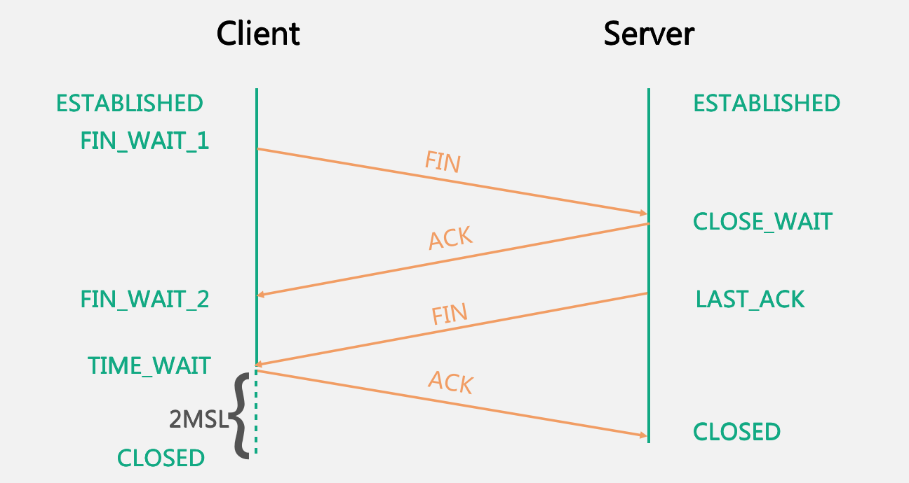

# 计算机网络

## 网络五层模型

### 每层常用协议

* 应用层
  * **HTTP**：超文本传输协议, 用于在客户端和服务端之间传输 HTML
  * FTP：文件传输协议, 用于在客户端和服务端之间传输文件
  * SMTP：简单邮件传输协议
  * TELNET：服务器远程登录控制
  * **DNS**：域名系统
  * **SSH**：安全外壳协议, 一种加密的网络传输协议
  * DHCP：动态主机配置协议, 局域网动态分配 IP 地址
* 传输层
  * **TCP**：传输控制协议
  * UDP：用户数据报协议
* 网络层
  * **IP**：网际协议, 用于网络互连数据交换, 最大努力交付
  * ICMP：互联网控制消息协议, 用于返回通信环境的错误消息.traceroute 和 ping 都是基于 ICMP 协议
  * IGMP：网际组管理协议, 用于管理 IP 多播成员
  * 一些路由选择协议
    * 内部网关协议类：用于自治系统内的协议
      * RIP：路由信息选择协议, 小规模网络使用, 使用 Ford 距离向量算法
      * OSPF：开放最短路径优先, 使用 Dijkstra 算法, 收敛快, 可实现多条路径的负载均衡
    * 外部网关协议类：用于网关内外信息交换的协议
      * BGP：边界网关协议, 基于路径向量信息, 可控制是否允许和某个自治系统进行信息交换
  * **ARP**, RARP：IP 与 MAC 地址转换
* 数据链路层
  * PPP：点对点协议
  * CSMA/CD：载波监听（发送前检查是否有其他站在发送数据）、多点接入（总线型网络）、碰撞检测（边发送边监听是否发生信号碰撞）
* 物理层
  * IEEE802：网络的 IEEE 标准

### 从输入一个URL到页面加载完成的过程

1. 用户输入 URL 并回车后, 浏览器主进程开启新的网络线程, 准备发送 HTTP 请求.
2. 浏览器进行 DNS 查询, 将域名解析为 IP 地址.
   * 搜索浏览器的 DNS 缓存
   * 搜索操作系统的 DNS 缓存
   * 读取本地的 Host 文件
   * *向本地 DNS 服务器查询*
   * *本地 DNS 服务器迭代查询根 DNS 服务器, 顶级 DNS 服务器*
3. 浏览器向服务器请求建立 TCP 连接和 SSL 连接.
4. 连接建立后, 浏览器发送 HTTP 请求.
5. 服务器处理请求, 并返回 HTTP 响应.
   * 负载均衡
   * 安全验证
   * 参数校检
   * 执行业务代码
   * 访问数据库
   * ...
6. 浏览器收到内容并交给渲染进程, 解析并绘制页面.
7. 如遇到静态资源的引用链接, 重复上述过程.

## 应用层

---

### http/https

HTTP和HTTPS的区别

1. 工作层不同.七层网络模型, HTTP 工作在应用层, HTTPS=HTTP+SSL, SSL工作在传输层.
2. 默认端口不同.HTTP 默认 80, SSL 默认 443.
3. 传输方式不同.HTTP 明文传输, HTTPS 加密传输.
4. 工作耗时不同.HTTP 建立只需要 TCP 进行握手, HTTPS 除了 TCP 握手, 还需要 SSL 握手.
5. 显示形式不同.<http://, https://>
6. 费用不同.HTTPS 需要申请 SSL 证书.
7. 安全性不同.HTTP1.x 无状态, HTTPS 需要加密和身份认证.

session和cookie

* session 服务端保存用户信息
* cookie 客户端保存信息
  
  由于**http是无状态的**, 单次请求未包含请求者的全部信息, 这时服务端就会用 session 来标识请求者, 保存其信息.每次有新请求者时, 服务端会为这个请求者创建唯一的 session, 并生成一个配对的 cookie, 返回给请求者, 之后请求者就可以在每次请求中包含自己的 cookie, 来告诉服务端自己的信息存在哪个 session 里.客户端还可以在 cookie 中保存一些信息, 比如表单自动填充的数据等等.  
  
禁用cookie后如何保持登录状态

* URL 重写.服务端在创建 session 后, 使用`response.encodeURL(url)`方法对响应添加  sessionId 字段, 今后的客户端的请求 URL 中会包含 sessionId 参数.
* 在 header 中保存一个 token 字段.

  核心是获得 sessionId.
  
HTTP有哪些方法? 哪些方法是幂等的? 哪些方法是安全的? 哪些方法是可缓存的?

* 方法

  1. GET：获取 uri 指定的信息.
  2. POST：向服务端发送数据.
  3. HEAD：同 GET, 但 response 只返回头部, 不返回主体.一个典型应用是下载文件时首先获取头部中的文件大小, 再分片下载服务器资源.
  4. PUT：创建或替换 uri 指定的服务器上的整个文件.
  5. PATCH：替换目标资源的部分内容
  6. DELETE：删除 uri 指定的服务器上的文件.
  7. OPTIONS：通知或查询通信选项.可以返回服务器支持的 HTTP 请求方法, 可以探测服务器的性能.
  8. TRACE：用于在代理环境中检查请求改写情况, 服务器的响应中包含了收到的请求报文的全部内容.
  9. CONNECT：建立一个到目标资源标识符的服务器的隧道, 今后的 HTTP 都以代理身份发送.
  
* 幂等
  1. 同样的请求方法**执行一次**和**执行多次**对服务端的副作用是相同的, 注意不要理解为**每次执行**的副作用相同.
  2. GET、HEAD、PUT、DELETE、OPTIONS 方法都是幂等的
  3. POST 方法不是幂等的, 因为同样的请求执行多次会再服务端提交多份数据, 而不是一份
  
  * 安全
    1. 对服务器数据只读的方法.
    2. GET、HEAD、OPTIONS 等方法都是只读的, 安全方法一定幂等
    3. PUT、DELETE、POST 等方法是不安全的
  
* 可缓存: GET、HEAD.
  
GET 和 POST 的区别

|           |                  GET                  |                       POST                       |
| :----------: | :--------------------------------------: | :------------------------------------------------: |
|    语义    |           获取服务器指定数据           |                 向服务器发送数据                 |
|    缓存    |                 可缓存                 |                     不会缓存                     |
|    幂等    |                  幂等                  |                      非幂等                      |
|  参数位置  |                query 中                |                 query 或 body 中                 |
|  参数长度  |                2048字节                |                      无限制                      |
| 浏览器行为 | 允许收藏, 保留历史记录, 后退刷新无影响 | 不能收藏, 不保留历史记录, 后退刷新会重新提交表单 |
|          |                                       |                                                 |

HTTP 状态码

* ```1xx```：信息响应
  * 100 Continue：表示正常, 允许客户端继续发送请求.当请求头带有这个字段时, 服务端会响应此状态
* ```2xx```：成功响应
  * 200 OK
  * 201 Created：请求成功, 并因此创建了新资源.通常作为 POST 请求的响应
  * 204 No Content：请求成功, 但没有 body, 浏览器维持原页面不变
  * 206 Partical Content：处理了部分 GET 请求, 会包含处理请求的范围, 用于断点续传、分片下载等
* ```3xx```：重定向, 在头部中添加字段 ```Location```
  * 301 Moved Permanently：永久重定向
  * 302 Found：临时重定向, 如将 HTTP 流量跳转至 HTTPS
  * 304 Not Modified：客户端 GET 请求资源自上一次请求未改变.该响应无 body, 用于```协商缓存```
  * 307 Temporary Redirect：临时重定向, 并维持原请求方法.302 有可能会使一些客户端的第二次请求方法强制变为 GET
* ```4xx```：客户端错误
  * 400 Bad Request：请求报文语法错误或参数错误
  * 401 Unauthorized：未认证、未登录
  * 403 Forbidden：无权限访问
  * 404 Not Found
  * 405 Method Not Allowed
* ```5xx```：服务器错误
  * 500 Internal Server Error
  * 502 Bad Gateway：网关或代理服务器接收了上游服务器的无效响应
  * 503 Service Unavailable：常见原因为服务器在维护停机
  
HTTP 各版本的变化

* HTTP/0.9
  * 只支持 GET 方法, 只支持单行指令请求, 只支持响应 HTML 字符串
* HTTP/1.0
  * 请求中加入**版本信息**
  * 引入了 **header**
  * 响应中加入了**状态码**
  * 默认使用**短链接**
* HTTP/1.1
  * 默认支持**长连接**
    * 节省了频繁建立 TCP 连接、慢启动、关闭连接的时间
    * 占用了服务器资源
  * 支持**响应分块/断点续传**
  * 引入**管线化**, 即连续请求不再阻塞, 而是流水线式发送
    * 降低了通信延迟
    * 若队头响应阻塞了, 那之后的响应都会阻塞
  * 引入了 Host 头, 支持不同域名配置在同一 IP 地址上
  * 引入了内容协商头, 可协商编码 ```Accept-Encoding``` 等
  * 引入了更多和缓存相关的头部字段
  * 引入了更多的错误状态响应码
* HTTP/2.0
  * header 压缩
    * 每个长连接中, 客户端和服务端共同维护一个表, 描述头部信息, 头部只包含**追加**或**替换**的字段值
  * 服务端推送
    * 服务器可对一个请求发送**多个响应**, 如提前发送一些静态资源
  * 多路复用
    * 使用**二进制分帧**交错返回多个请求的响应, 而不需要按请求序依次返回响应, 实现了真正的并发处理多个连续请求, 克服了**管线化**头部阻塞问题
    * **二进制分帧**指：
      1. 使用高效的**二进制**编码内容, 而不是字符编码.
      2. 在 HTTP 和 TCP 之间加入分帧层, 将响应分为数个帧, 使用帧号标识该帧属于哪个请求的响应, 客户端再自行组合.
  
HTTP 的分块传输编码？

* 原理：将 body 主体用回车换行分隔开, 每一部分称为一个**块**.块的结构为：  

  > 第一块长度值\r\n  
  > 内容\r\n  
  > 第二块长度值\r\n  
  > 内容\r\n  
  > ...  
  > 0\r\n
  >

  注意最后一块的长度为 0, 用于定位边界
* 设置方法：头部 ```Transfer-Encoding: chunked``` , 还可结合压缩方法一起使用, 如 ```Content-Encoding: gzip```
* 应用场景

  * 大网页分块显示, 而不是等全部接收完毕后再开始加载
  * 无法计算响应的 ```Content-Length``` 导致无法判断响应的终止边界
  
### dns

域名和IP地址相互映射

## 传输层

---

### MSL, RTT, MSS

* MSL: Maximum Segment Lifetime. 报文最大生存时间, 任何 TCP 报文在网络上存在的最长时间, 一般设置为 30 s、60 s、120 s
* RTT: Round Trip Time, 客户端到服务端往返时间, 用于计算超时重传时间和拥塞窗口, 由 TCP 估算
* MSS: Maximum Segment Size, TCP报文段单次最大分段大小（一般为 1460 字节, 加上 20 字节 TCP 头部, 20 字节 IP 头部, 正好为 1500 字节, 即 IP 分片最大长度）

### tcp
  
TCP 如何实现可靠传输

* TCP三次握手

  * 第一次握手: 服务端收到客户端的同步报文, 服务端确认客户端发送功能正常, 服务端接收功能正常
  * 第二次握手: 客户端收到服务端的同步确认报文, 客户端确认服务端发送功能正常, 客户端接收功能正常, 同时还能确认第一次握手的客户端发送功能正常, 服务端接收功能正常, 至此, 客户端认为连接可以建立
  * 第三次握手, 服务端收到客户端的同步确认报文, 服务端也能够确认所有收发功能正常, 可以建立连接.

  
  
* TCP四次挥手
  

* 超时重传(*累积确认和选择确认机制*)
* *以字节为单位的滑动窗口*

TCP 如何实现流量控制

* 利用接收端窗口大小控制发送端流量
* 使用 **Nagle 算法**使发送端发送尽可能长的报文
* 使用**接收方确认等待机制**避免返回很小的窗口大小
  
TCP 如何实现拥塞控制

1. 基于丢包的拥塞控制：Reno
   * 慢开始
   * 拥塞避免
   * 快重传和快恢复
2. 基于时延 RTT 的带宽预测：vegas
   * RTT 增大, 则线性减少 cwnd, 反之亦然
   * 小 RTT 的连接更新 cwnd 快, 容易占有更多资源
3. 基于丢包和 RTT：westwood
   * 单位平均 RTT 内收到 ACK 减少过多, 说明拥塞
   * 单位平均 RTT 内收到 ACK 减少一点, 说明是常态丢包, 影响不大
4. 二分搜索最佳 cwnd：BIC
   * 丢包时乘法减小
   * 每轮 RTT 二分增大, 更快收敛于上次丢包点（log 函数形状）
   * 超过上次丢包点后仍未丢包, 认为网络好转, 开始指数增大
   * 同样, 小 RTT 的连接更新快, 容易占有更多资源
5. 连续拥塞间隔：CUBIC
   * 窗口曲线为类似 BIC 的三次多项式
   * 丢包时乘法减小
   * 不再是每次收到 ACK 时根据 RTT 更新 cwnd, 而是脱离了 RTT, 根据距离上次丢包的时间间隔来更新 cwnd
   * 横轴由单位 RTT 变为了单位时间, 保证了不同 RTT 连接的公平性
6. 基于精准带宽计算：BBR
   * 实时计算带宽和最小 RTT 来同时控制发送速率和 cwnd, 而不是只控制 cwnd
7. IP 层的路由器的基于发送队列长度的随机早检测算法
  
建立连接后客户端故障怎么办

* 服务端维护**保活计时器**, 一般设置为 2 小时, 超过此时间未收到客户端报文, 则每隔 75 分钟发送探测报文, 若连续 10 个探测报文无回应, 则服务器断开连接.
  
TCP、UDP 有什么区别

|                            TCP                            |                            UDP                            |
| :----------------------------------------------------------: | :----------------------------------------------------------: |
|                          面向连接                          |                           无连接                           |
|                        提供可靠交付                        |                       尽最大努力交付                       |
|                         面向字节流                         |                          面向报文                          |
|                           速度慢                           |                           速度快                           |
|                           全双工                           |               一对一、一对多、多对一、多对多               |
|                    有流量控制和拥塞控制                    |                    无流量控制和拥塞控制                    |
| 应用于要求准确性高或要求有连接的场景, 如文件传输、邮件发送 | 应用于要求效率高而对准确定性要求低的场景, 如即时通信、直播 |
|             应用层有 SMTP、TELNET、HTTP、FTP等             |         应用层有DNS（主辅通讯除外）、TFTP、DHCP等         |
  
TCP 流式传输

缓冲区、Nagle 算法、无边界、字节流...

## 网络层

---

### ip

路由表接力

TTL

* Time To Life：IP 数据报在网络中可存活的总跳数, 每经过一个路由器就减 1, 减至 0 则通过 ICMP 报文通知源主机.
  
IP 号分类规则？

* IP 号划分为 5 类, 每一类由**网络号**+**主机号**组成, 前三类为**单播**地址, 第四类为**多播**地址.  
  
IP 如何划分子网

* 将主机号的前几位作为子网编号, 使用**子网掩码**来分辨网络号.
  
ARP协议

* 用于将 IP 地址解析为局域网内对应的 MAC 地址, 并将映射关系定时缓存入主机.

  * **广播请求**：主机在局域网内广播发送请求, 给出自己的 IP 地址和 MAC 地址, 以及目标 IP 地址
  * **单播回应**：局域网内所有主机检查 IP 地址, 若不匹配则丢弃, 否则单播返回响应, 给出自己的 MAC 地址
  
NAT

* 专用网主机和因特网主机通讯时的地址转换协议.  一个 NAT 路由器拥有多个全球 IP 地址, 每个 IP 地址还可以通过不同的端口号进行复用.  
* 专用网主机向因特网主机发送通信请求, 则会占有一个**全球 IP：端口号**
* 因特网主机向专用网主机发送通信请求, 需首先给专用网分配固定的**全球 IP：端口号**
  
## 网络安全

---

HTTPS 的四次握手？

1. 客户端发起请求
   * ClientHello：客户端给出自己支持的 **SSL 版本**、支持的**加密组件**（加密算法、密钥长度等）
2. 服务端回应请求
   * ServerHello：服务端给出自己的 **SSL版本**以及客户端和自己都支持的**加密组件**
   * Certificate：紧接着服务端给出自己的**公钥**和 **CA 证书**报文
   * Server Hello Done：紧接着发送 SSL 握手协商结束报文
3. 客户端给出密钥
   * Change Key Exchange：客户端生成随机密码串作为新的**密钥**, 使用服务端给出的公钥加密, 并发送给服务端
   * Change Cipher Spec：客户端告知服务端用刚才自己发送的密钥进行加密通信
   * Finished：客户端在此报文中给出之前全体报文的校检值
4. 服务端响应密钥
   * Change Cipher Spec：同客户端
   * Finished：同客户端
  
消息摘要是什么

* 数据按照某种 Hash 算法, 生成一串长度固定的 Hash 值, 这个值就是数据的摘要.  
* 常见的**摘要算法**有 MD5（128位）、SHA256（256位） 等.  显然, 摘要算法是单向的, 且速度比加密算法要快.
  
数字签名

* 结合非对称加密和消息摘要, 用于验证数据是否是可信的.  
* 发送者生成数据的消息摘要, 准备将数据和消息摘要一同发送给接收者
* 为了防止消息摘要被篡改, 对消息摘要进行非对称加密后再发送（也就是数字签名）
* 接收者收到数据并计算出收到数据的消息摘要, 收到数字签名并使用公钥解密出原消息摘要, 若两者相同, 则数据未被篡改（公钥私钥是一一对应的, 使用这个公钥只能解密出对应私钥加密的数据）

### 数字证书是什么？

若用来解密签名的公钥被篡改, 则数字签名失效.数字证书就是用来保证接收者收到的公钥确实是发送者提供的.  
和数字签名的思想类似, 为了保证公钥 key 不被篡改, 将公钥看成数据体, 使用私钥 private_key_0 获得公钥 key 的数字签名 S, 一同发送给客户端.客户端使用 公钥 key_0 解密公钥 key 的数字签名 S, 验证公钥 key 是否被修改.  
**数字证书**就包含了**需要保证正确性的公钥 key**, 这个 key 和一些证书信息（拥有者, 有效期等）的**数字签名 S**.  
为了保证 key 是正确的, 那么就需要保证解密 S 的公钥 key_0 是正确的.显然, 这是一个递归验证.验证终止条件为**公钥 key_0 一定未被修改**, 这就是**根证书**的来源.  
根证书是权威机构颁发的证书, 预装在操作系统里, 即客户端本地保存有根证书的公钥 key_0, 它是一定正确的.
  
### 为什么 Cookie 无法防止 CSRF 攻击, 而 Token 可以？

CSRF（Cross Site Request Forgery）攻击, 即**跨站请求伪造**攻击.攻击者通过给出链接等形式, 诱使受害者向某一网站发送请求.  
由于浏览器发送请求会自动带上 cookie, 因此服务器认为该请求是受害者自己的意愿, 但实际上是攻击者指使的.攻击者只是利用了 cookie, 而不必知道具体 cookie 内容.  
使用 token, 服务器要求每个请求需要在 url 中加入 token 字段, 而 token 字段需要受害者浏览器手动添加.攻击者无法知道带有受害者 token 的 url 是什么样子的, 因此受害者点击链接就不会携带正确的 token.
  
### 什么是 SYN 攻击？如何检测防范？

原理：利用 TCP 的三次握手, 伪造大量 IP 地址发起连接.由于 IP地址不存在, 因此无法进行第二次握手, 服务器端大量连接处于 ```SYN_RECV``` 状态（半连接）, 并不断发送同步确认包, 直至连接超时.大量半连接消耗了服务端资源, 导致网络堵塞甚至瘫痪.  
检测：若服务端出现大量半连接, 尤其是 IP 地址是随机的, 那么很有可能出现了 SYN 攻击.  
防范：通过防火墙过滤 IP；改 TCP 协议参数, 如增加最大半连接数、缩短超时时间等.
  
### Token 认证有什么优势？

1. 无状态, 服务端无需存储 session.这也导致了 token 废弃时需要等它有效期过才能生效, 除非服务端做额外处理.
2. 能避免 CSRF 攻击.
3. 单点登录友好.token 保存在客户端, 而不需要服务端保存.而 session 不适合于分布式系统.
4. 移动端友好.cookie 对移动端不友好, 每次请求都算一个新的 session.
  
---

## 部分来源
  
<https://imageslr.com/2020/07/08/tech-interview.html>  
<https://github.com/Snailclimb/JavaGuide/blob/master/docs/system-design/authority-certification/basis-of-authority-certification.md>
